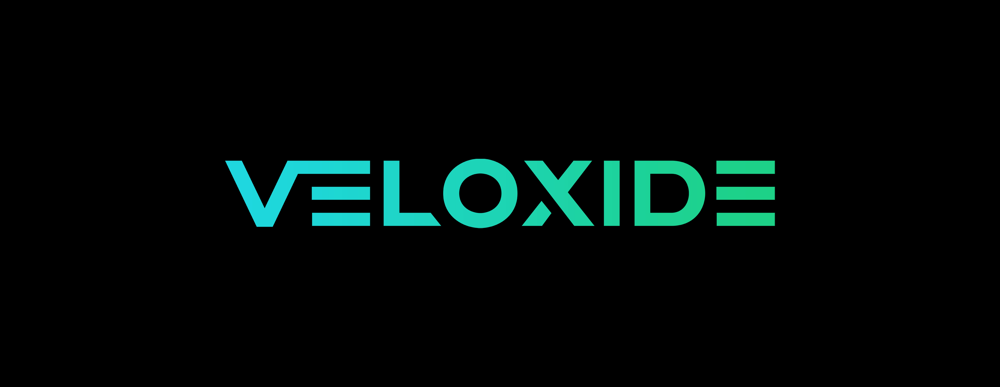

<!-- markdownlint-disable MD033 -->
<!-- markdownlint-disable MD041 -->

<p align="center">
    <a href="https://github.com/liamwh/Veloxide"></a>
    <p align="center">
    </p>
    <p align="center">
        <a href="https://github.com/liamwh/veloxide/actions?query=workflow%3AVeloxide-ci+event%3Apush+branch%3Amain">
            
        </a>
        <a href="https://blog.rust-lang.org/2022/11/03/Rust-1.65.0.html">
            </a>
        <a href="https://github.com/rust-secure-code/safety-dance/">
            
        </a>
        <a href="https://guide.veloxide.org">
            
        </a>
        <a href="https://github.com/liamwh/veloxide/blob/main/README.md">
            
        </a>
    </p>

---

Veloxide simplifies the web API development process, letting you focus on delivering value to your consumers. With Veloxide, you can enjoy a modern, easy-to-use, and fast technology stack that can be integrated with your business logic.

Its key qualities are:

- **Fast to code**: Veloxide increases the speed of development by being simple, flexible and easy to use. Rust naturally [shifts bugs left](https://en.wikipedia.org/wiki/Shift-left_testing) to the compiler, so less time is spent debugging code, and more time is spent delivering value.
- **Fewer bugs**: All components of Veloxide are written in [Rust](https://www.rust-lang.org), which is known for its safety and reliability [[1]](https://www.infoq.com/news/2021/04/rust-linux-kernel-development/) [[2]](https://security.googleblog.com/2023/01/supporting-use-of-rust-in-chromium.html) [[3]](https://security.googleblog.com/2022/12/memory-safe-languages-in-android-13.html)
- **Highly performant**: Veloxide is built on top of the [Tokio](https://tokio.rs) async runtime and [Axum framework](https://github.com/tokio-rs/axum), which leverage the power of Rust's [async/await syntax](https://doc.rust-lang.org/reference/expressions/await-expr.html) and [zero-cost abstractions](https://doc.rust-lang.org/beta/embedded-book/static-guarantees/zero-cost-abstractions.html) to give blazingly fast bare-metal performance.
- **Cloud native**: Veloxide comes pre-configured with [OpenTelemetry](https://opentelemetry.io/) for distributed tracing and a /metrics endpoint preconfigured for collection from [Prometheus](https://prometheus.io/).
- **Standards-based**: Veloxide leverages the open standards for APIs: [OpenAPI](https://github.com/OAI/OpenAPI-Specification), [JSON Schema](https://json-schema.org/specification.html) and [GraphQL](https://graphql.org/). You choose how you want your API to be consumed.

## Design Patterns

Veloxide comes pre-configured with the following design patterns to support maintainability and flexibility:

- **[CQRS](https://learn.microsoft.com/en-us/azure/architecture/patterns/cqrs)**: Veloxide uses Command Query Responsibility Segregation (CQRS) to help simplify and optimize the design by separating the read (view) and write (command) models.
- **[Event Sourcing](https://martinfowler.com/eaaDev/EventSourcing.html)**: Veloxide uses Event Sourcing to persist domain events to the database. Event sourcing is used to tie the read and write models together, as well as providing a complete and accurate audit trail of changes made to a system, which can be useful for debugging, compliance, and various other purposes.
- **[Layered Architecture](https://en.wikipedia.org/wiki/Multitier_architecture)**: The codebase is divided into layers, each with a specific responsibility, as per the principles of [Domain-Driven Design](https://en.wikipedia.org/wiki/Domain-driven_design). This makes the application more modular, as well as easier to understand and maintain.

## Getting started

Install the pre-requisites:

- [Rust](https://www.rust-lang.org/tools/install)
- [Docker](https://docs.docker.com/get-docker/)
- [just](https://github.com/casey/just)
- [Protobuf Compiler](https://grpc.io/docs/protoc-installation/)

Install the Veloxide CLI:

```sh
> cargo install veloxide
```

Create your own app:

```zsh
> veloxide init my-app

# Go to the created folder
> cd my-app

# Install the required tools for development
> just install-required

# Set the environment to use the Postgres config, start the supporting containers, and then run the app
> just dev-postgres

# Once done, open `my-app/` in your IDE

# Happy Coding!
```

- The OpenAPI interactive documentation will be accessible at `http://localhost:8080/swagger-ui/`
- The GraphQL Playground will be accessible at `http://localhost:8080/graphql`
- There is a [postman-collection](https://github.com/liamwh/veloxide/tree/main/veloxide-demo.postman_collection.json) that supports both the REST and GraphQL APIs for you to import
- Additional helper commands can be shown by running `just` in the root directory.

## User guide

The complete guide to Veloxide is accessible at [guide.veloxide.org](https://guide.veloxide.org).

## Contributors

- **[Liam Woodleigh-Hardinge](https://bit.ly/422Y4Lo)**: Creator
- **[Lucas Moulton-Wotherspoon](https://bit.ly/3l5zqsS)**: Graphics and Design
- You? 😊
